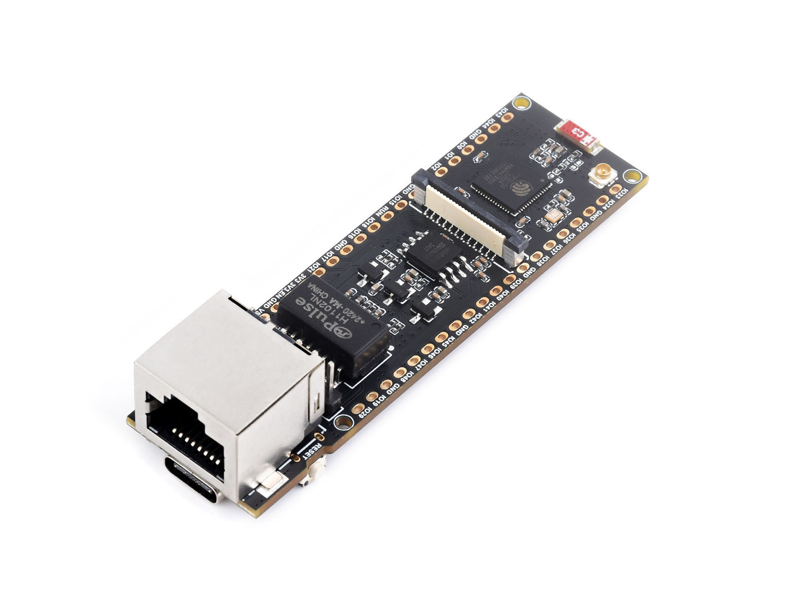
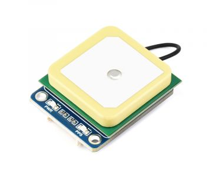
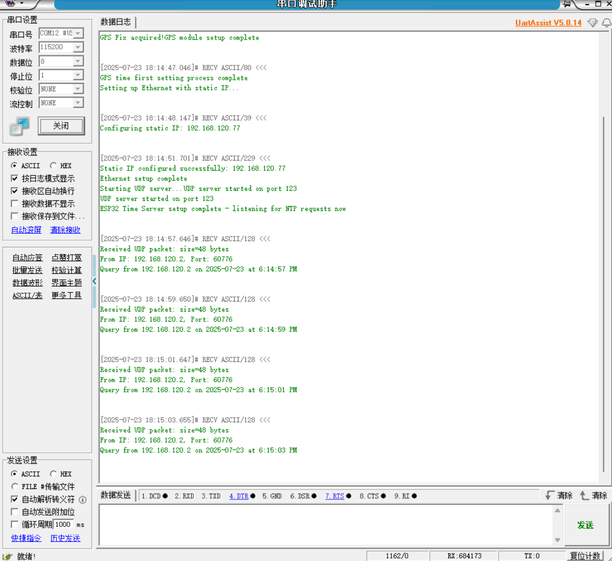
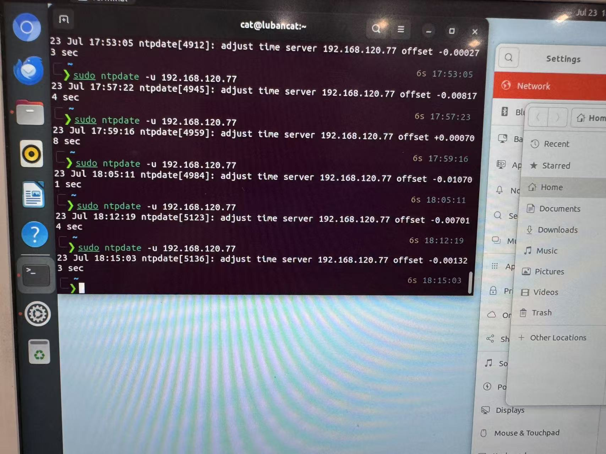

# ESP32时间同步服务器 (ESP32 Time Sync Service)

基于ESP32-S3+W5500+LC76G的高精度NTP时间服务器，通过GPS模块提供微秒级时间同步服务。本项目实现了一个完整的网络时间协议(NTP)服务器，可为局域网内的设备提供精确的时间同步服务。


## 硬件要求

### 主控制器
- **ESP32-S3-ETH<[官方文档](https://www.waveshare.com/wiki/ESP32-S3-ETH)>**: 主控制器

  

### 网络模块
- **W5500以太网模块**: 提供有线网络连接
  - CS引脚: GPIO 14 
  - RST引脚: GPIO 9
  - INT引脚: GPIO 10
  - MISO引脚: GPIO 12
  - MOSI引脚: GPIO 11
  - SCK引脚: GPIO 13

### GPS模块：
- **支持NMEA 0183协议的GPS模块：LC76G<[官方文档](https://www.waveshare.com/wiki/LC76G_GNSS_Module)>**

  

  - RX引脚: GPIO 44
  - TX引脚: GPIO 43
  - PPS引脚: GPIO 1
  - 波特率: 115200
  - 使用硬件串口，使用Serial1作为GPS串口（根据自己设备情况更改）

### 网络配置
- 支持静态IP配置
- 默认配置示例:
  - IP地址: 192.168.120.77
  - 网关: 192.168.120.1
  - 子网掩码: 255.255.255.0
  - DNS: 192.168.120.1
  - MAC地址：可在mac[] ={0xXX, ... }中设置

## 🔧 软件配置

### 依赖库
项目使用PlatformIO构建，主要依赖库包括：
- `ESP32Time`: ESP32内部RTC管理
- `Time`: Arduino时间处理库
- `Timezone`: 时区和夏令时处理
- `Ethernet`: W5500以太网支持

### 关键配置参数

#### GPS配置 (`ESP32TimeServerKeySettings.h`)
```cpp
#define GPS_RX_PIN 44      // GPS模块RX引脚
#define GPS_TX_PIN 43      // GPS模块TX引脚  
#define GPS_PPS_PIN 1      // GPS模块PPS引脚
#define GPS_BAUD 115200    // GPS模块波特率

#define GPS_DEVICE Serial1  // 使用Serial作为GPS设备
```

#### 网络配置
```cpp
#define ETHERNET_STATIC_IP    IPAddress(192, 168, 120, 77)
#define ETHERNET_GATEWAY      IPAddress(192, 168, 120, 1) 
#define ETHERNET_SUBNET       IPAddress(255, 255, 255, 0)
#define ETHERNET_DNS          IPAddress(192, 168, 120, 1)

#define DHCP_STATUS false // 是否启用DHCP
```

#### NTP服务配置
```cpp
#define NTP_PORT 123       // NTP标准端口
#define NTP_PACKET_SIZE 48 // NTP数据包大小
```

#### 时间同步周期配置
```cpp
// 时间定义(默认时间单位为微秒)
const unsigned long oneSecond_inMilliseconds = 1000;
const unsigned long oneMinute_inMilliseconds = 60 * oneSecond_inMilliseconds;
const unsigned long fiveMinutes_inMilliseconds = 5 * oneMinute_inMilliseconds;

// 同步周期定义为5分钟
const unsigned long periodicTimeRefreshPeriod = fiveMinutes_inMilliseconds;
```

## 使用方法

### 1. 硬件连接
按照硬件要求部分的引脚定义连接各个模块：
- 将W5500以太网模块连接到指定的SPI引脚
- 将GPS模块连接到指定的串口引脚
- 确保PPS信号正确连接到GPIO 1

### 2. 软件配置
1. 根据你的网络环境修改 `ESP32TimeServerKeySettings.h` 中的IP配置
2. 如需要，调整GPS模块的串口配置
3. 根据所在时区修改时区设置

### 3. 系统启动流程
系统启动后会按以下顺序初始化：

1. **关闭WiFi和蓝牙**: 节省系统资源
2. **GPS模块初始化**: 配置GPS串口和PPS中断
3. **GPS定位等待**: 等待GPS获取有效定位信号
4. **时间同步任务启动**: 后台启动GPS时间同步任务
5. **以太网连接**: 配置静态IP并建立网络连接
6. **NTP服务启动**: 启动UDP服务器监听123端口
7. **服务就绪**: 开始响应NTP时间请求

### 4. NTP客户端配置
将客户端设备的NTP服务器地址设置为ESP32的IP地址（如：192.168.120.77）

### 调试模式
通过修改 `debugIsOn` 变量可以启用详细调试输出：
```
bool debugIsOn = true;  // 启用调试模式
```
## 使用示例
使用串口助手监听ESP32模块的串口调试信息输出：



通过网线连接到鲁班猫4，使用ntpdate控制台命令进行同步



## 📄 许可证

本项目采用MIT许可证 - 详见LICENSE文件

---

**注意**: 本项目仅用于学习和实验目的。在关键应用中使用前请进行充分测试和验证。